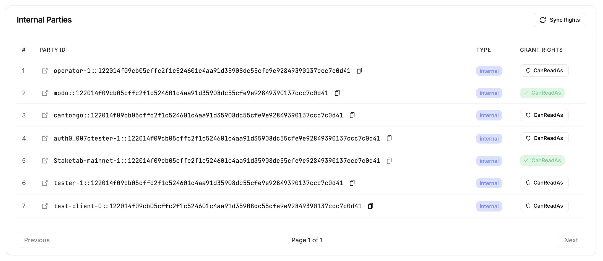

# Modo Private App

Blockchain indexer and monitoring explorer for Canton Validators.

---

## Table of Contents

- [Overview](#overview)
- [Prerequisites](#prerequisites)
- [Deployment Options](#deployment-options)
  - [Docker Setup](#docker-setup)
  - [Kubernetes Setup](#kubernetes-setup) *(coming soon)*
- [Configuration](#configuration)
  - [Environment Variables](#environment-variables)
  - [Authentication](#authentication)
    - [Auth0 Setup](#auth0-setup)
    - [Keycloak Setup](#keycloak-setup) *(coming soon)*
    - [Other OIDC Providers](#other-oidc-providers) *(coming soon)*
- [Quick Start](#quick-start)
- [Commands Reference](#commands-reference)
- [Upgrading](#upgrading)
- [Reading Ledger API from Internal Parties](#reading-ledger-api-from-internal-parties)

---

## Overview

**Modo Private App. Tailored for You.**

Unlock exclusive access to Canton data on your own infrastructure.

- **Private Transactions** - Track wallet operations and private transfers effortlessly through flexible, customizable filters
- **Read Contract Interface** - All contract details, always at hand
- **Apps & Rewards** - Gain full visibility into income from apps and blockchain validation
- **Powerful Private Labeling** - Unlock blockchain insights through smart labeling, making discovery as natural as reading
- **Intelligence Analytics** - Comprehensive analytics for transfers, rewards, fees and more
- **Token Wallet Explorer** - Full wallet exploration capabilities
- **Multi-Party Support** - Manage and monitor multiple parties from a single interface

---

## Prerequisites

- Docker Compose v2.0+
- Access to Canton Ledger API and Wallet API
- Auth0 tenant

---

## Deployment Options

**Primary:** Deploy on the same server as your Canton validator. This is the recommended setup as it allows direct access to Ledger API and Wallet API without exposing them externally.

**Remote:** You can deploy on a separate server, but this requires exposing `LEDGER_API_URL` and `WALLET_API_URL` externally. **⚠️ This requires proper security configuration (TLS, firewall rules, authentication) to protect your APIs.**

### Docker Setup

See [Quick Start](#quick-start) section.

### Kubernetes Setup

*Coming soon.*

---

## Configuration

### Environment Variables

Clone the repository and configure:

```bash
git clone https://github.com/Staketab/modo-private-app
cd modo-private-app/docker
cp env.example .env
```

| Variable | Description | Example |
|----------|-------------|---------|
| `AUTH_TENANT` | Auth0 tenant domain | `your-tenant.eu.auth0.com` |
| `AUTH_M2M_CLIENT_ID` | Machine-to-Machine client ID (from validator) | `aB1cD2eF3gH4iJ5k` |
| `AUTH_M2M_CLIENT_SECRET` | M2M client secret (from validator) | `your-secret-here` |
| `AUTH_AUDIENCE` | API audience identifier | `https://your-api.example.com` |
| `AUTH_APP_CLIENT_ID` | Frontend SPA application client ID | `xY9zW8vU7tS6rQ5p` |
| `LEDGER_API_URL` | Canton Ledger API endpoint (include prefix if applicable) | `http://participant:7575` |
| `WALLET_API_URL` | Wallet API endpoint (include prefix if applicable) | `http://validator:5003/api/validator` |
| `DOCKER_NETWORK` | External Docker network name | `canton-network` |
| `POSTGRES_DB` | Database name | `app` |
| `POSTGRES_USER` | Database user | `app` |
| `POSTGRES_PASSWORD` | Database password | `your-secure-password` |
| `POSTGRES_HOST` | Database host (`db` for local, hostname for remote) | `db` |
| `POSTGRES_PORT` | Database port | `5432` |
| `IMAGE_TAG` | Docker image version | `v1.1.0` |
| `LOG_LEVEL` | Logging level (DEBUG, INFO, WARN, ERROR) | `INFO` |
| `MAIN_PARTY_ID` | MAIN Validator party ID for indexing | `main-validator-party` |

> **Note:** For `LEDGER_API_URL` and `WALLET_API_URL`, include the full path prefix if your APIs use one (e.g., `http://host:port/api/validator`).

---

### Authentication

#### Auth0 Setup

The M2M (Machine-to-Machine) application is already configured in your validator. You only need to create a Single Page Application for the frontend.

1. Go to [Auth0 Dashboard](https://manage.auth0.com/)
2. Navigate to **Applications → Applications**
3. Click **Create Application**
4. Select **Single Page Application**
5. Name it `Modo Frontend`
6. Configure settings:
   - **Allowed Callback URLs:** `http://localhost:3000, https://your-domain.com`
   - **Allowed Logout URLs:** `http://localhost:3000, https://your-domain.com`
   - **Allowed Web Origins:** `http://localhost:3000, https://your-domain.com`
7. Note the **Client ID** and set it in your `.env`:

```env
AUTH_APP_CLIENT_ID=<Client ID from step 7>
```

Get the M2M credentials from your validator configuration and set them in `.env`:

```env
AUTH_TENANT=your-tenant.eu.auth0.com
AUTH_M2M_CLIENT_ID=<from validator>
AUTH_M2M_CLIENT_SECRET=<from validator>
AUTH_AUDIENCE=<from validator>
```

#### Keycloak Setup

*Coming soon.*

#### Other OIDC Providers

*Coming soon.*

---

## Quick Start

### With Local Database

```bash
cd docker

# 1. Configure environment
cp env.example .env
# Edit .env with your settings (see Configuration section)

# 2. Start all services
make setup-local

# 3. Access the application
# Frontend: http://localhost:3000
```

### With Remote Database

```bash
cd docker

# 1. Configure environment
cp env.example .env
# Edit .env - set POSTGRES_HOST to your remote database hostname

# 2. Start all services
make setup-remote

# 3. Access the application
# Frontend: http://localhost:3000
```

---

## Commands Reference

```bash
# Quick setup
make setup-local          # Setup with local database
make setup-remote         # Setup with remote database

# Service management
make up-local             # Start services (local DB)
make up-remote            # Start services (remote DB)
make down-local           # Stop all services
make down-remote          # Stop all services
make restart-local        # Restart all services
make restart-backend      # Restart backend only

# Logs
make logs-local           # View all logs
make logs-backend         # View backend logs only
make logs-frontend        # View frontend logs only

# Database (local only)
make db-up                # Start database
make db-down              # Stop database
make db-logs              # View database logs

# Utilities
make ps                   # Show running containers
make pull                 # Pull latest images
make clean                # Remove stopped containers
make help                 # Show all commands
```

---

## Upgrading

To upgrade to a new version:

1. Update `IMAGE_TAG` in your `.env` file:
   ```env
   IMAGE_TAG=v1.1.0
   ```

2. Pull and restart:
   ```bash
   make pull
   make restart-local  # or make restart-remote
   ```

---

## Reading Ledger API from Internal Parties

To read Ledger API data from internal parties other than the validator party, you need to grant **CanReadAs** rights to the application.

This can be done directly in the application on the **Parties** page:

1. Navigate to **Parties** in the application
2. Find the internal party you want to read from
3. Click **CanReadAs** in **Grant Rights** column



---

## Support

For issues and feature requests, please open an issue in the repository.
